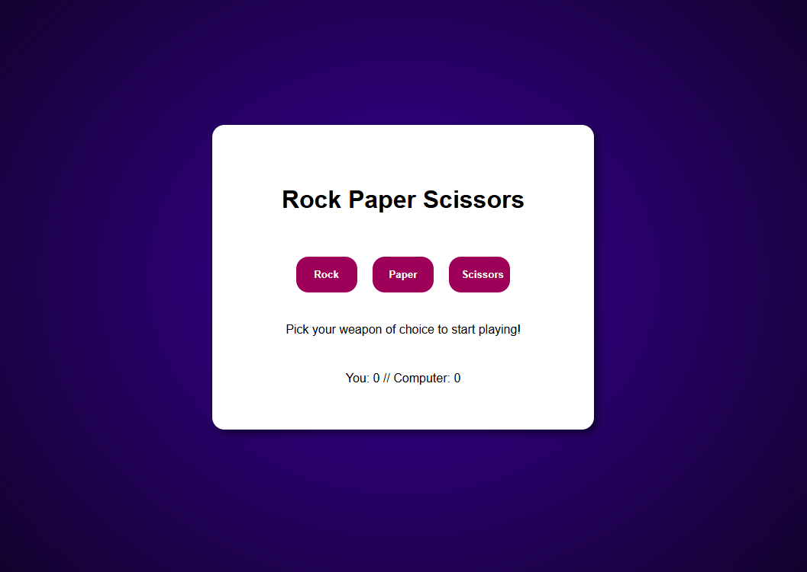

# Rock Paper Scissors Game

This exercise project is built using **HTML5**, **JavaScript**, and **CSS**.

## Features
- **User Choice**: Select Rock, Paper, or Scissors.
- **Random Machine Choice**: The machine randomly picks Rock, Paper, or Scissors.
- **Best Out of Three**: First to win three rounds is the winner.
- **Reset Button**: Appears after three rounds to restart the game.
- **CSS Animation**: If you win, enjoy a celebratory **CSS animation** using polygons and keyframes!

## Technologies Used
- **HTML5** for the structure of the game.
- **JavaScript** for game logic.
- **CSS** for styling and animation.

Project Link: [https://linneatoth.github.io/rockpaperscissors](https://linneatoth.github.io/rockpaperscissors)
